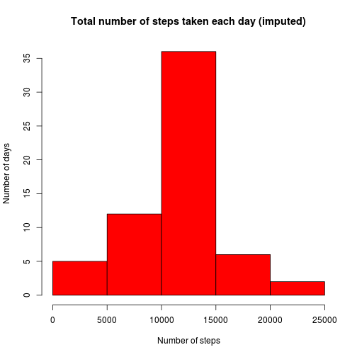

# Reproducible Research: Peer Assessment 1

-------------------------------------------------

## Loading and preprocessing the data

#### 1. Load the data (i.e. `read()`)


```r
## read in activity.csv data file to dataframe df
df <- read.csv("activity.csv", sep=",", header=TRUE)

## display summary of df
summary(df)
```

```
##      steps               date          interval   
##  Min.   :  0.0   2012-10-01:  288   Min.   :   0  
##  1st Qu.:  0.0   2012-10-02:  288   1st Qu.: 589  
##  Median :  0.0   2012-10-03:  288   Median :1178  
##  Mean   : 37.4   2012-10-04:  288   Mean   :1178  
##  3rd Qu.: 12.0   2012-10-05:  288   3rd Qu.:1766  
##  Max.   :806.0   2012-10-06:  288   Max.   :2355  
##  NA's   :2304    (Other)   :15840
```

#### 2. Process/transform the data (if necessary) into a format suitable for your analysis


```r
## convert date column as date type
df$date <- as.Date(df$date, "%Y-%m-%d")

## create a dataframe totalstepsperday to aggregate the total number of steps taken per day
totalstepsperday <- aggregate(steps ~ date, data=df, sum, na.rm=TRUE)
head(totalstepsperday)
```

```
##         date steps
## 1 2012-10-02   126
## 2 2012-10-03 11352
## 3 2012-10-04 12116
## 4 2012-10-05 13294
## 5 2012-10-06 15420
## 6 2012-10-07 11015
```

-------------------------------------------------

## What is mean total number of steps taken per day?

#### 1. Make a histogram of the total number of steps taken each day


```r
## load lattice
library(lattice)

## create histogram for total number of steps taken per day
hist(totalstepsperday$steps, main="Total number of steps taken each day", xlab="Number of steps", ylab="Number of days", col="green")
```

 

#### 2. Calculate and report the **mean** and **median** total number of steps taken per day

The mean total number of steps taken per day is

```r
## calculate the mean total number of steps taken per day
mean(totalstepsperday$steps)
```

```
## [1] 10766
```

The median total number of steps taken per day is

```r
## calculate the median total number of steps taken per day
median(totalstepsperday$steps)
```

```
## [1] 10765
```

-------------------------------------------------

## What is the average daily activity pattern?

#### 1. Make a time series plot (i.e. ```type = "l"```) of the 5-minute interval (x-axis) and the average number of steps taken, averaged across all days (y-axis)


```r
## create a dataframe ts for the 5-minute interval and the average number of steps taken, averaged across all days
ts <- tapply(df$steps, df$interval, mean, na.rm=TRUE)

## display time-series plot
plot(row.names(ts), ts, type="l", main="Average number of steps taken\nper 5-minute interval,\naveraged across all days", xlab="5-minute interval", ylab="Average number of steps taken", col="blue")
```

 

#### 2. Which 5-minute interval, on average across all the days in the dataset, contains the maximum number of steps?

The 5-minute interval, on average across all the days in the dataset, contains the maximum number of steps is

```r
## Which 5-minute interval, on average across all the days in the dataset, contains the maximum number of steps
names(which.max(ts))
```

```
## [1] "835"
```

-------------------------------------------------

## Imputing missing values

#### 1. Calculate and report the total number of missing values in the dataset (i.e. the total number of rows with ```NA```s)

Since only steps column contains ```NA```s, we can sum all its ```NA```s. The total number of missing values in the dataset is

```r
## calculate and report the total number of missing values in df$steps
sum(is.na(df$steps))
```

```
## [1] 2304
```

#### 2. Devise a strategy for filling in all of the missing values in the dataset. The strategy does not need to be sophisticated. For example, you could use the mean/median for that day, or the mean for that 5-minute interval, etc.

In order to fill in the missing values, the mean steps for a 5-minute interval will be used.

```r
## load Hmisc
library(Hmisc)
```

```
## Loading required package: grid
## Loading required package: survival
## Loading required package: splines
## Loading required package: Formula
## 
## Attaching package: 'Hmisc'
## 
## The following objects are masked from 'package:base':
## 
##     format.pval, round.POSIXt, trunc.POSIXt, units
```

```r
## create an imputed dataframe dfi
dfi <- df

## impute 
dfi$steps <- with(dfi, impute(steps, fun=mean))
```


#### 3. Create a new dataset that is equal to the original dataset but with the missing data filled in.

The new dataset, dfi, was created in the last step. It is equal to the original dataset but with the missing data fillin in. Let's compare the original dataset, df, with the imputed dataset, dfi, as follows.

```r
## summary of the original dataset, df
summary(df)
```

```
##      steps            date               interval   
##  Min.   :  0.0   Min.   :2012-10-01   Min.   :   0  
##  1st Qu.:  0.0   1st Qu.:2012-10-16   1st Qu.: 589  
##  Median :  0.0   Median :2012-10-31   Median :1178  
##  Mean   : 37.4   Mean   :2012-10-31   Mean   :1178  
##  3rd Qu.: 12.0   3rd Qu.:2012-11-15   3rd Qu.:1766  
##  Max.   :806.0   Max.   :2012-11-30   Max.   :2355  
##  NA's   :2304
```

```r
## summary of the imputed dataset, dfi
summary(dfi)
```

```
## 
##  2304 values imputed to 37.38
```

```
##      steps            date               interval   
##  Min.   :  0.0   Min.   :2012-10-01   Min.   :   0  
##  1st Qu.:  0.0   1st Qu.:2012-10-16   1st Qu.: 589  
##  Median :  0.0   Median :2012-10-31   Median :1178  
##  Mean   : 37.4   Mean   :2012-10-31   Mean   :1178  
##  3rd Qu.: 37.4   3rd Qu.:2012-11-15   3rd Qu.:1766  
##  Max.   :806.0   Max.   :2012-11-30   Max.   :2355
```

#### 4. Make a histogram of the total number of steps taken each day and Calculate and report the mean and median total number of steps taken per day. Do these values differ from the estimates from the first part of the assignment? What is the impact of imputing missing data on the estimates of the total daily number of steps?


```r
## create a dataframe totalstepsperdayimputed to aggregate the total number of steps taken per day on the imputed dataset
totalstepsperdayimputed <- aggregate(steps ~ date, data=dfi, sum, na.rm=TRUE)
head(totalstepsperdayimputed)
```

```
##         date steps
## 1 2012-10-01 10766
## 2 2012-10-02   126
## 3 2012-10-03 11352
## 4 2012-10-04 12116
## 5 2012-10-05 13294
## 6 2012-10-06 15420
```

```r
## create histogram for total number of steps taken per day on the imputed dataset
hist(totalstepsperdayimputed$steps, main="Total number of steps taken each day (imputed)", xlab="Number of steps", ylab="Number of days", col="red")
```

 

The mean total number of steps taken per day (imputed) is

```r
## calculate the mean total number of steps taken per day (imputed)
mean(totalstepsperdayimputed$steps)
```

```
## [1] 10766
```

The median total number of steps taken per day (imputed) is

```r
## calculate the median total number of steps taken per day (imputed)
median(totalstepsperdayimputed$steps)
```

```
## [1] 10766
```

The mean of the original dataset and that of the imputed dataset are the same. However, the median of the original dataset and that of the imputed dataset are slightly different.

-------------------------------------------------

## Are there differences in activity patterns between weekdays and weekends?

#### 1. Create a new factor variable in the dataset with two levels – “weekday” and “weekend” indicating whether a given date is a weekday or weekend day.


```r
## create a daytype function to determine the levels
daytype <- function(d) {
  if (weekdays(d) %in% c("Saturday", "Sunday")) {
    return ("Weekend")
  } else {
    return ("Weekday")
  }
}

## create and add the factor, daylevel, to the imputed dataset, dfi
dfi$daylevel <- as.factor(sapply(dfi$date, daytype))
head(dfi)
```

```
##   steps       date interval daylevel
## 1 37.38 2012-10-01        0  Weekday
## 2 37.38 2012-10-01        5  Weekday
## 3 37.38 2012-10-01       10  Weekday
## 4 37.38 2012-10-01       15  Weekday
## 5 37.38 2012-10-01       20  Weekday
## 6 37.38 2012-10-01       25  Weekday
```

#### 2. Make a panel plot containing a time series plot (i.e. type = "l") of the 5-minute interval (x-axis) and the average number of steps taken, averaged across all weekday days or weekend days (y-axis).


```r
## create a daytype function to determine the levels
totalstepsperdayleveled <- aggregate(steps ~ interval + daylevel, data=dfi, mean)

xyplot(steps ~ interval | daylevel, totalstepsperdayleveled, type="l", layout=c(1, 2), main="Activity patterns between weekdays and weekends", xlab="Interval", ylab="Number of steps")
```

 
